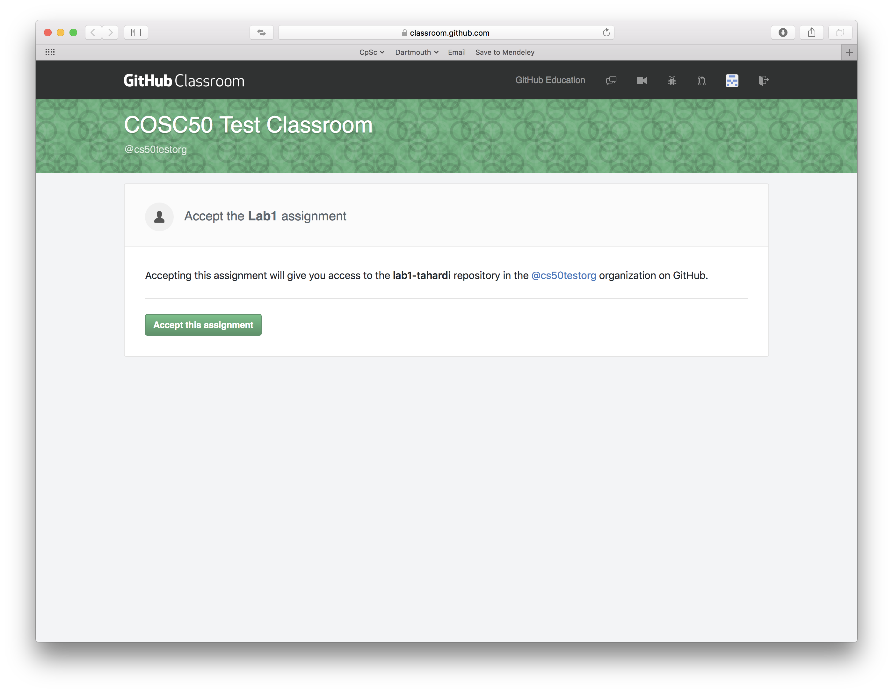
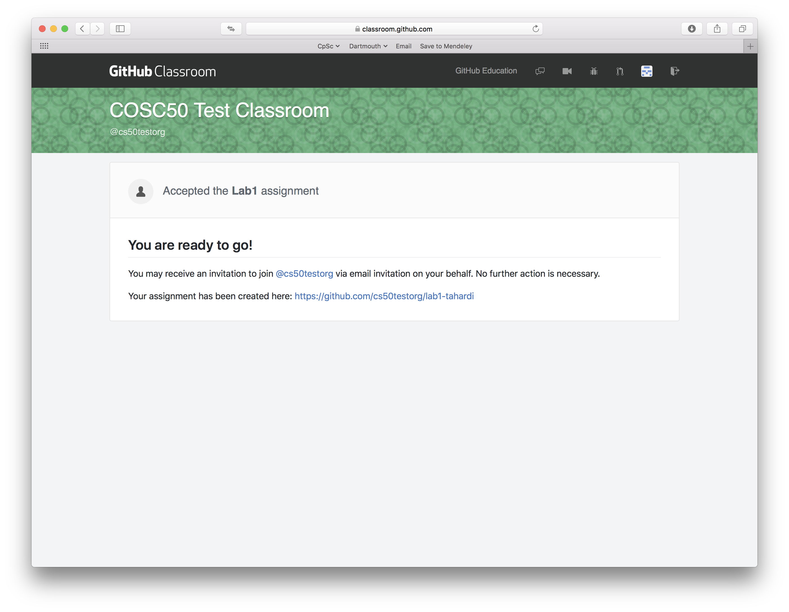
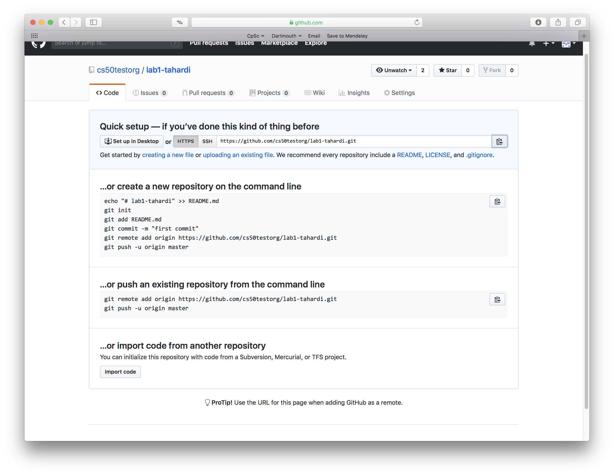
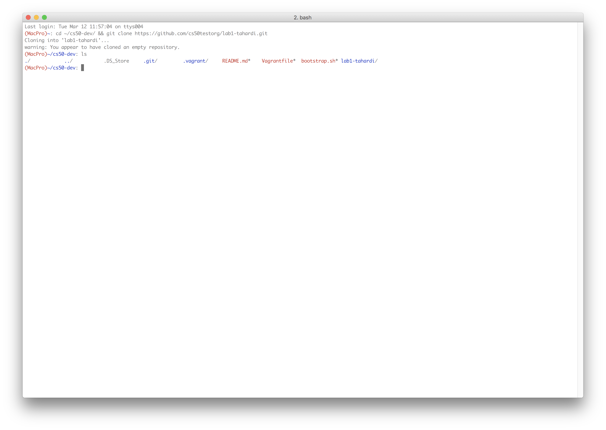
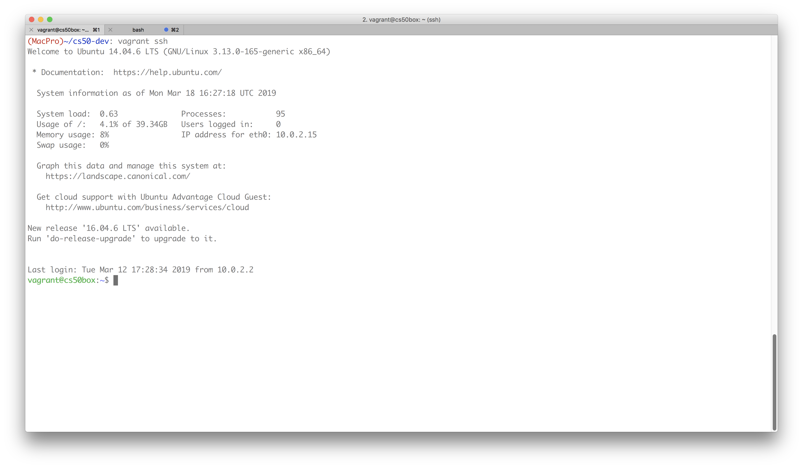
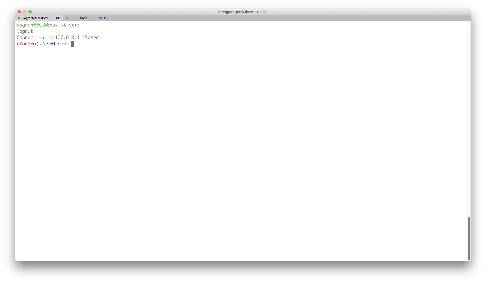
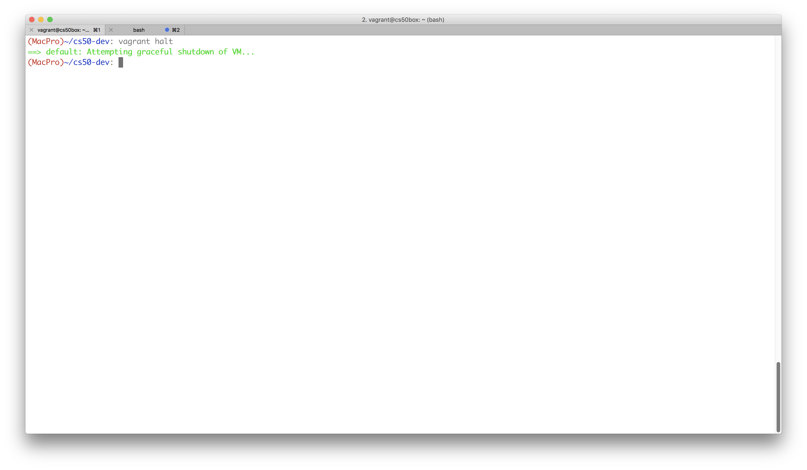
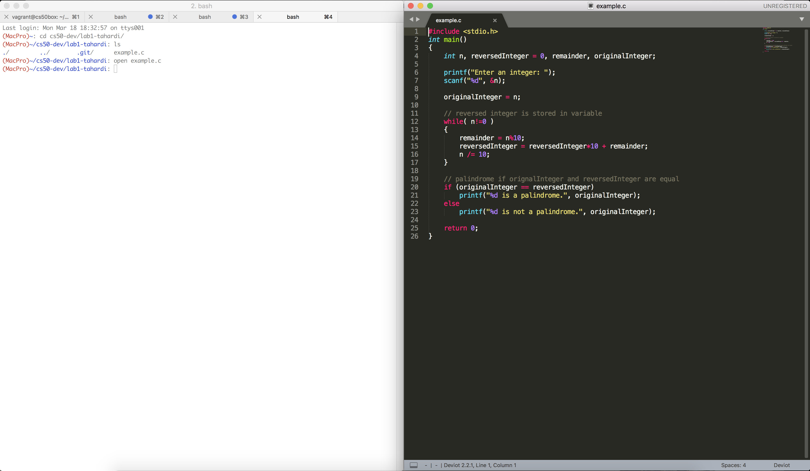
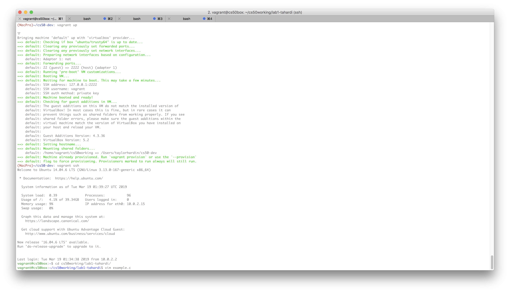

# Overview
This repository contains top-level files (i.e. Vagrantfile and bootstraph.sh) for downloading and configuring your Virtual Machine (VM), which you will use for compiling and running your lab assignments. Below, we detail how to clone and setup this repository, download assignments, and write/compile/execute your code. 

#### Table of Contents

- [Setup Your Development Environment For OSX](setup/osx-setup.md)
- [Setup Your Development Environment For Windows](setup/windows-setup.md)
- [Downloading Lab Assignments](#downloading-lab-assignments)
- [Using The Virtual Machine](#using-the-virtual-machine)
- [Writing Code](#writing-code)
- [Compiling and Executing Code](#compiling-and-executing-code)
	
# Downloading Lab Assignments
You will be using your VM to compile and test your lab assignments. Assignments will be handed out and managed via GitHub classroom. For every assignment, you will be sent a link for GitHub classroom that will instantiate a new repository for you. You will use these repositories to backup and turn in code. The process for cloning a new assignment repo to your computer is detailed below.

1. Click on the GitHub Classroom assignment link. You will be redirected to a page like the one pictured below.



2. After clicking accept, GitHub Classroom will create a repository to hold the code for your assignment. Click the URL following "Your assignment has been created here:" to view your new assignment repo. 



3. On your repo page, copy the HTTPS URL from the quick setup section.



4. Open **Terminal** and navigate to your `cs50-dev` folder. Once you are in the `cs50-dev` folder, clone your assignment repo. Use the following command to do this (**NOTE: Remember to replace URL with the URL you copied from your assignment page**). Afterwards, you can use `ls` to check that your assignment repo was cloned to thee `cs50-dev` folder.

```
cd ~/cs50-dev && git clone URL
```



# Using the Virtual Machine
## Powering On/Off the VM
To compile and execute your code you first need to turn on and log into your VM. Open the **terminal** application and navigate to `cs50-dev` folder and run the `vagrant up` command to start the VM.

```
cd ~/cs50-dev && vagrant up
```


Once the VM has been powered on, you can log into the machine with the following command:

```
vagrant ssh
```



When you are done using the VM you should first logout with the following command:

```
exit
```



Then shutdown the VM:

```
vagrant halt
```



## Writing Code
After cloning your GitHub Classroom assignment repo, you will want to start writing code and testing it on the VM. Before you do begin, however, it is important to note an interesting characteristic of your `cs50-dev` folder. This folder is shared between the **Host** (your machine) and the **Guest** (your VM). This means that everything in the `cs50-dev` folder is visible on both your machine and the VM, and you can edit files from either machine. Below we describe several different ways for writing code on both your host machine and VM.

### Writing Code On Your Host Machine
You can write code on your host machine through a command line editor (e.g., vim, emacs, nano) or using a text editor (e.g., Sublime, Atom, Notepad). If you wish to use a text editor, simply open the file you wish to edit using finder or the command line. Below is an example of opening a file from the command line (in OSX) and editing it in Sublime.



### Writing Code on Your VM
You can write code on your VM using a command line editor, but first remember to power on your VM, login, and navigate to yourr assignment repo.


	
Then open the file you wish to edit in your prefered editor.


## Compiling and Executing Code
You will need to make sure that your code compiles and runs on your VM machine. Before compiling your code, to make sure that you have done the following:

- Saved your code
- Powered on your VM: `vagrant up`
- Logged into your VM: `vagrant ssh`
- Navigated to your lab assignment directory: `cd cs50shared/labX`
