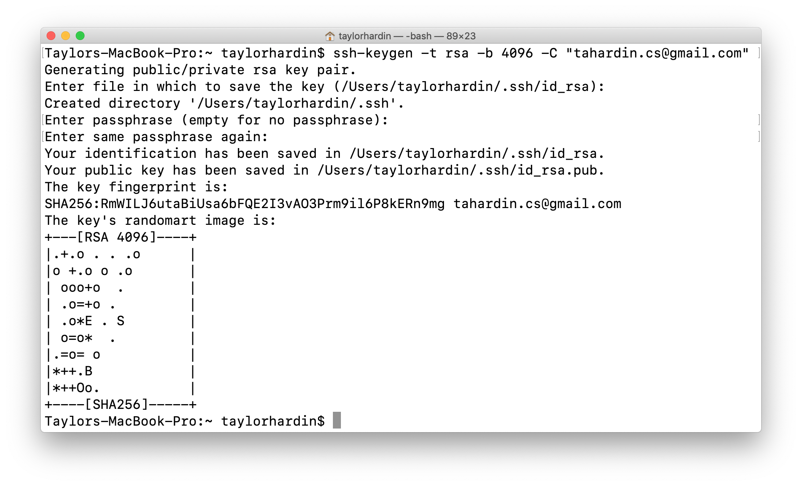
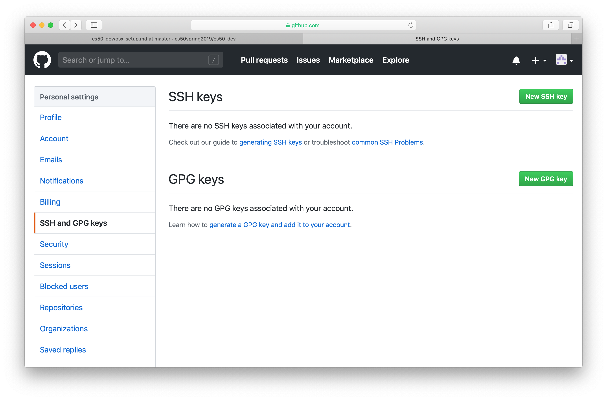
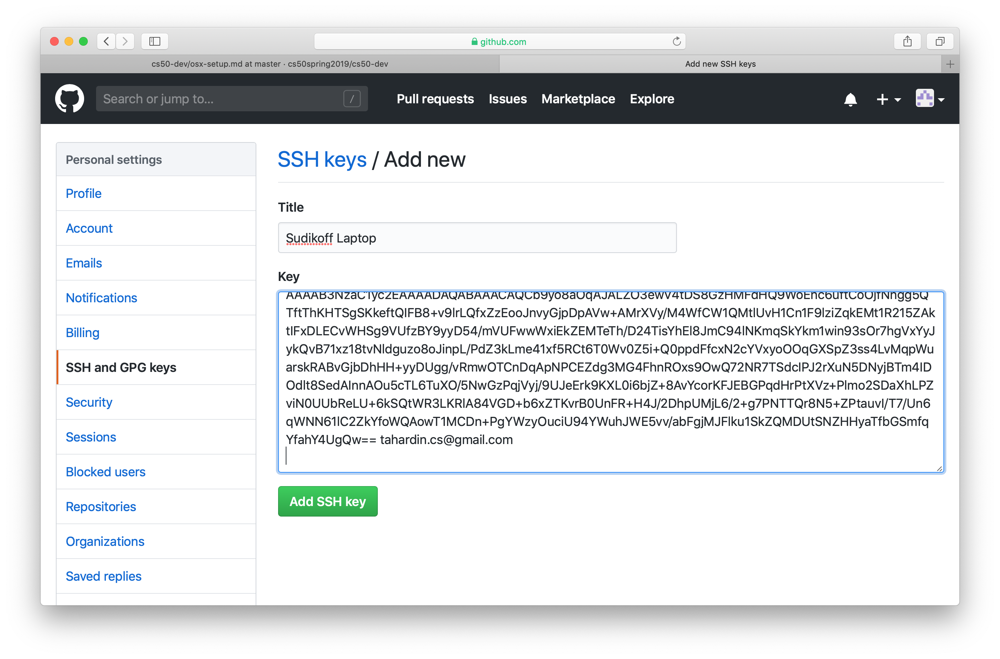
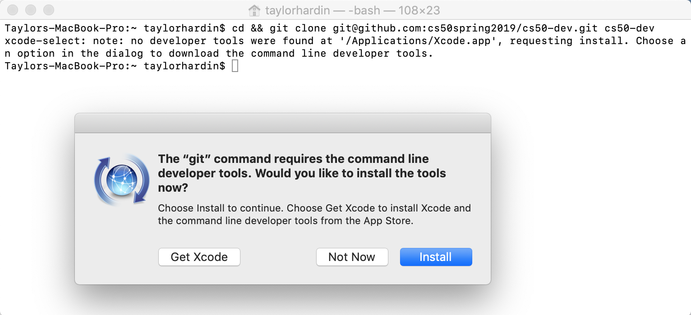
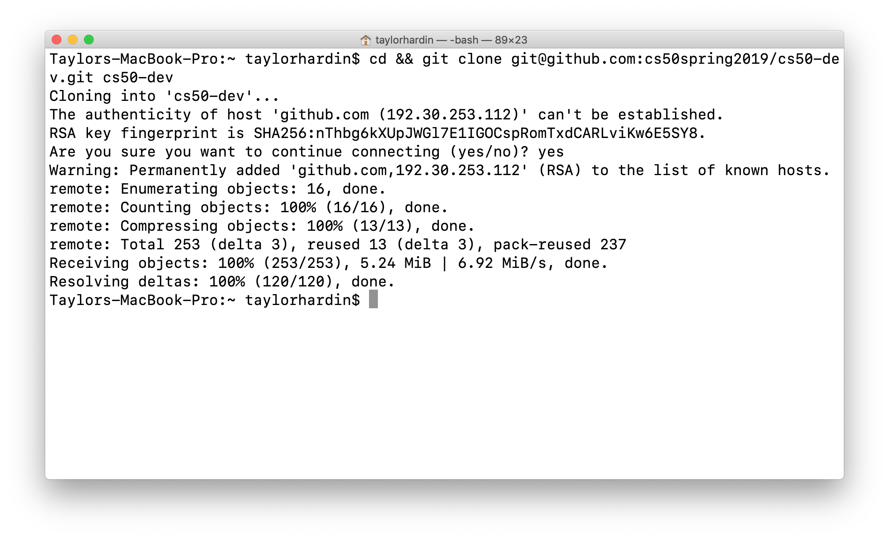
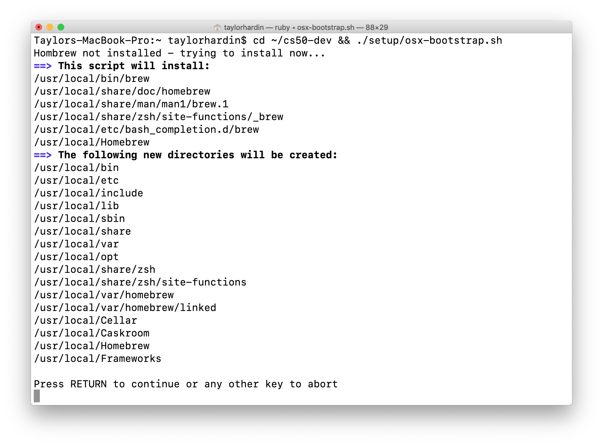
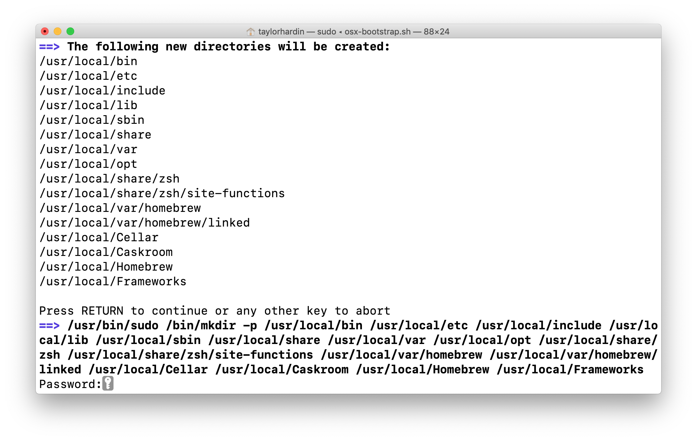
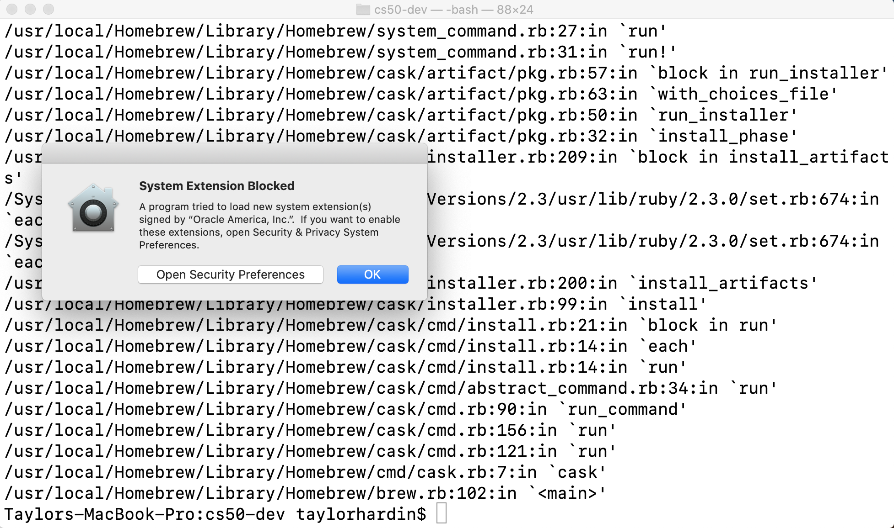
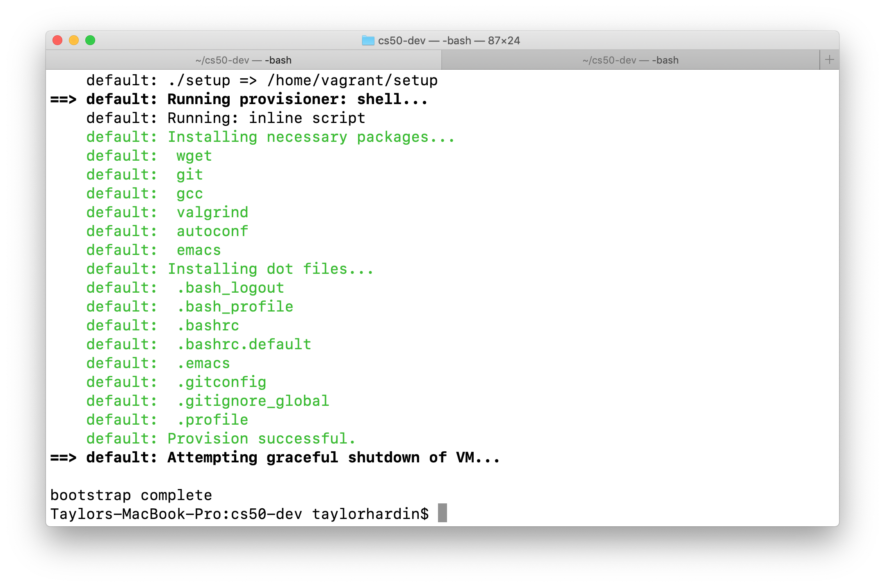
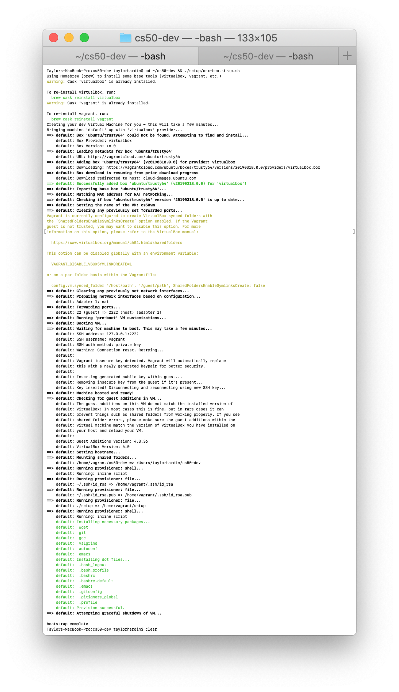

# Setup Your Development Environment For OSX

1. Create a [GitHub account](https://github.com).

<!---->

2. We need to configure SSH keys for pulling and pushing code with your new GitHub account. First, check to see if you already have an existing ssh key. Open the **Terminal** application, which is located at `Applications/Utilities`. Copy and paste the following command into terminal and press *enter* (⏎). This will list your ssh key files (if they exist). If **DO NOT** not have any keys, you should recieve a `No such file or directory` message as output. If you **DO** have an existing key, you should skip to step 4.

```
ls -al ~/.ssh
```

3. If you **DO NOT** have an existing ssh key, then you need to generate one. Copy and paste the below command into the terminal, substituting your GitHub email address **before** pressing *enter* (⏎). When you're prompted to "Enter a file in which to save the key," press *enter* (⏎). When you're prompted to "Enter passphrase (empty for no passphrase)" press *enter* (⏎) two more times. Picture below is example output from generating an ssh key.

```
ssh-keygen -t rsa -b 4096 -C "your_email@example.com"
```



4. After generating your new ssh key, you need to add it to your GitHub account. Copy your ssh key to your clipboard using the command below.

```
pbcopy < ~/.ssh/id_rsa.pub
```

5. Open a browser and navigate to [GitHub](https://www.github.com). After logging in, click on your profile photo in the upper-right corner of the page and navigate to **Settings/SSH and GPG Keys/New SSH key**.



6. In the "Title" field, add a descriptive label for the new key. For example, if you're using a personal Mac, you might call this key "Personal MacBook Air". Paste your key into the "Key" field. Click **Add SSH Key**.



7. Open the **Terminal** application. Copy and paste the below command and press *enter* (⏎) to clone the `cs50-dev` repository. You may receive a warning when you try to use git, like the one shown below. Go ahead and click install to install command line developer tools.

```
cd && git clone git@github.com:cs50spring2019/cs50-dev.git cs50-dev
```



8. Different from the error shown above, some have seen an error stating `invalid active devloper path` when attempting to clone the repo. If you see this, run the following command to install **Xcode**. After installing **Xcode**, rerun the git clone command from step 7.

```
xcode-select --install
```
	
9. After installing the command line developer tools, rerun the git clone command from step 7. If prompted with `Are you sure you want to continue connecting (yes/no)?` type `yes` and press *enter* (⏎).



10. Afterwards, paste the following command into **Terminal** and press *enter* (⏎). When prompted by the script, press *enter* (⏎) again.

```
cd ~/cs50-dev && ./setup/osx-bootstrap.sh
```



11. If prompted, enter the password for your computer (not GitHub account). **NOTE: when typing the characters in your password will not appear, but they are in fact being read.**


	
12. Some of those with Homebrew already installed have seen an error related to not being able to `create leading directories of /usr/local/Homebrew/...`. If you see this error, copy and paste the following command into **Terminal** and then rerun the boostrap script.

```
sudo chown -R "$USER":admin /usr/local/homebrew
# You will be asked to enter your computer's password
# After this completes, rerun the bootstrap script with the following command
./setupt/osx-bootstraph.sh
```


13. At some point during the bootstrap process you may recieve a popup (pictured below) blocking a system extension. You should click `Open Security Preferences` and then click `Allow`.


	
14. After clicking `Allow`, navigate back to your **Terminal** window and rerun the command from Step 9 (shown below). *This bootstrap process will take a while (~5-15 minutes depending on your internet connection)*. You should see "bootstrap complete" when the process is finished.

```
cd ~/cs50-dev && ./setup/osx-bootstrap.sh
```



15. After the installation script runs, read through its output to see if it printed any warnings or errors. It should end with "bootstrap complete", if it was successful. If not, please use the "Vagrant-MacOS" forum on Piazza to ask for help.

