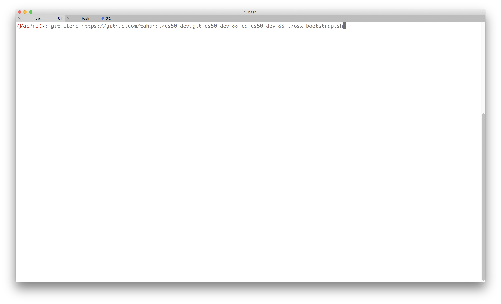
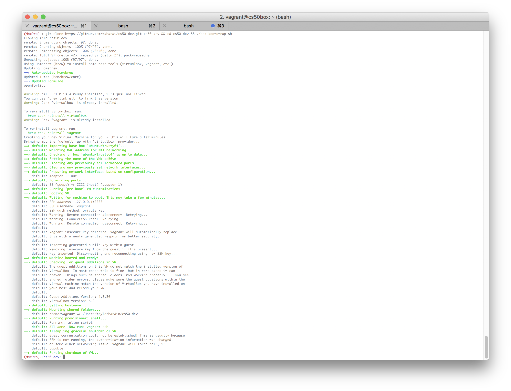

# Setup Your Development Environment For OSX

1. Create a [GitHub account](https://github.com).


2. Follow [GitHub's guide](https://help.github.com/en/articles/connecting-to-github-with-ssh) for generating a new SSH keey and adding it to your GitHub account. Namely, complete the steps listed below. These require you to open and paste commands into the **Terminal** application, which can be found in `Applications/Utilities` or by using spotlight (`cmd+spacebar`) to search for and open the application. **NOTE: Do not copy the `$` symbol at the beginning of the provided commands. Only copy text after the `$` symbol.**

	- Checking for existing SSH keys
		- Step 4: **DO NOT** enter a passphrase. Simply press *enter* (⏎) twice.
	- Generating a new SSH key and adding it to the ssh-agent
	- Adding a new SSH keey to your GitHub account
2. Open the **Terminal** application. Copy and paste the below command and press *enter* (⏎) to clone the `cs50-dev` repository.

```
cd && git clone git@github.com:cs50spring2019/cs50-dev.git cs50-dev
```


	
2.1. You may receive a warning when you try to use git, like the one shown below. If you do, install the Xcode Development Tools and rerun the command from step 2.

**Insert picture showing Xcode development tools installation**

3. Afterwards, paste the following command into **Terminal** and press *enter* (⏎). Enter the email and password for your **github** account. **NOTE: The characters in the password field will not show up, but they are in fact being read**. You *may* also be prompted for your **computer's** password at some point so that the installation script has the necessary permissions for downloading software on your computer.

```
cd ~/cs50-dev && ./setup/osx-bootstrap.sh
```

**Insert picture showing this step**

**Insert picture showing password prompt**

4. After the installation script runs, read through its output to see if it printed any warnings or errors. It should end with "bootstrap complete", if it was successful. If not, please use the "Vagrant-MacOS" forum on Piazza to ask for help.

> **Replace this image with one on a vanilla machine (there are some brew packages already installed on this one)**
