# Setup Your Development Environment For Windows

1. Install Git for Windows. Please go to https://git-scm.com/download to download the windows version and then install it on your PC. Default installation configuration is fine. You can follow the figures below if you are not sure about it.

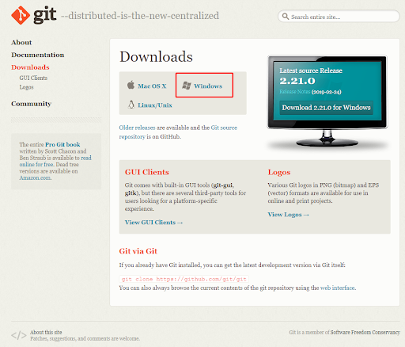

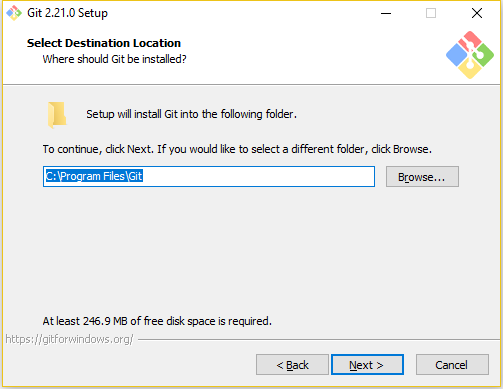

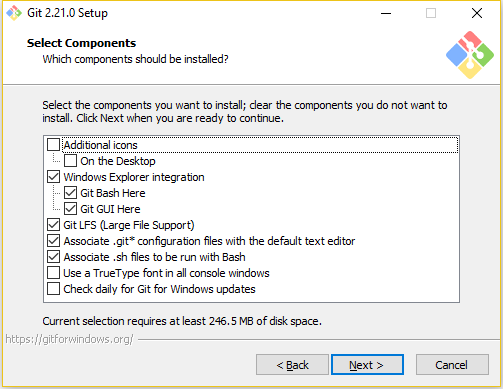

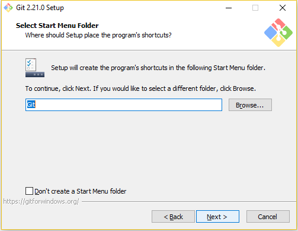

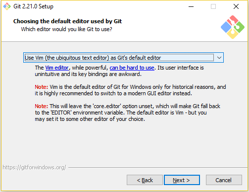

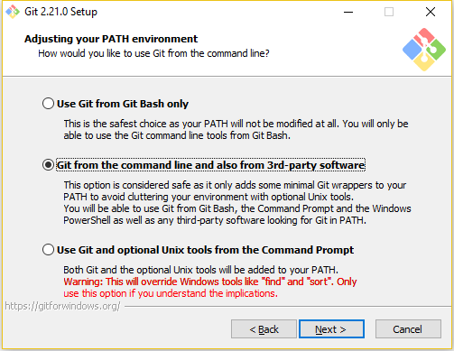

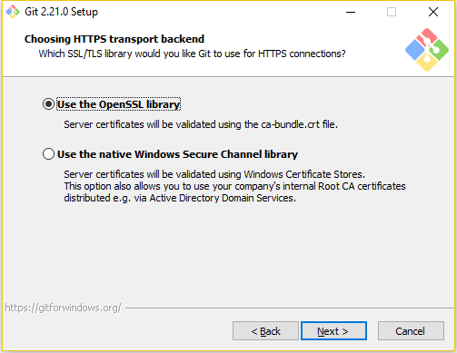

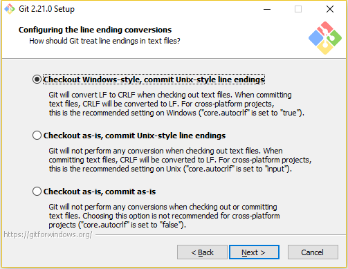

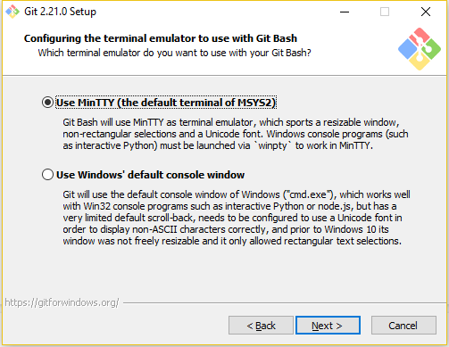

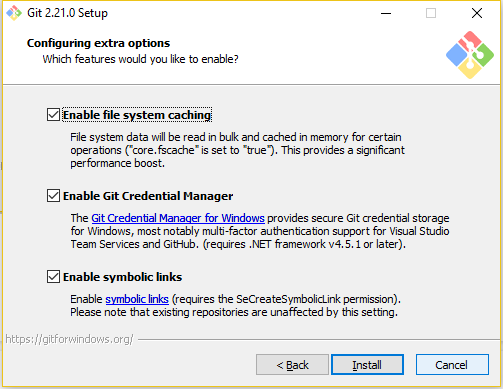


2. Install Vagrant and VirtualBox. Please go to [VirtualBox Downloads](https://www.virtualbox.org/wiki/Downloads) and [Vagrant Downloads](https://www.vagrantup.com/downloads.html). Then install them on your PC.

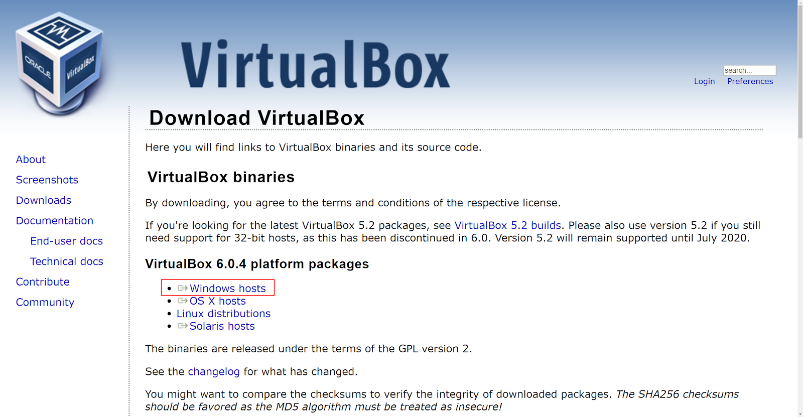

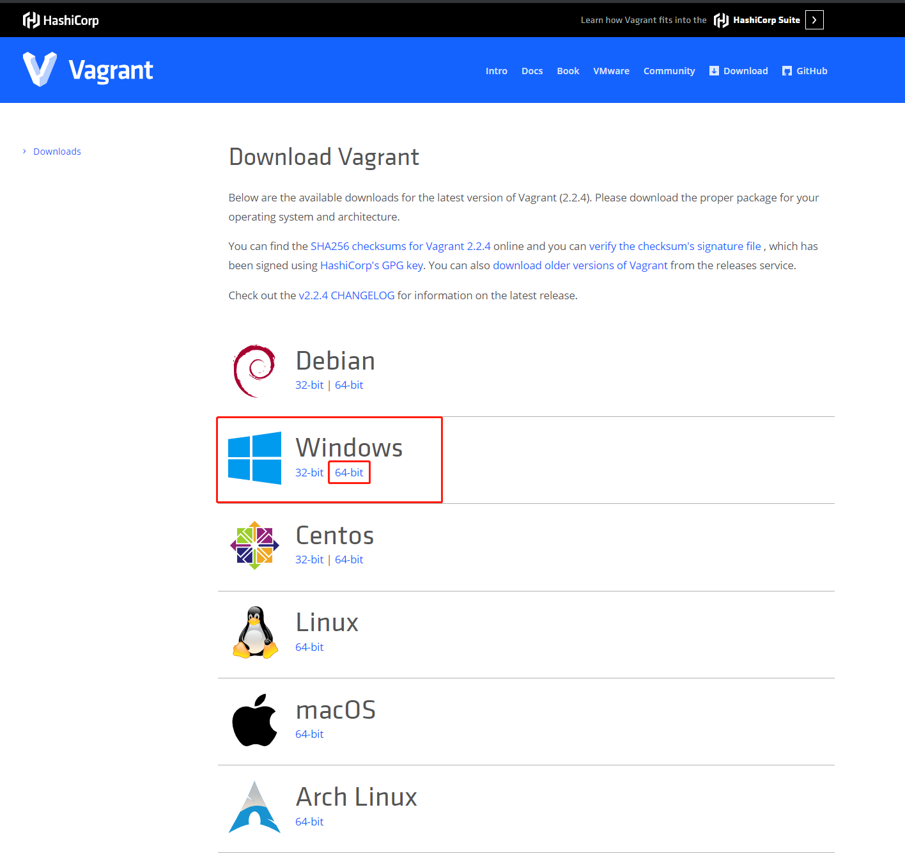


3. Then you can use Windows Command Prompt to use these tools. You can use following commands to check whether they are installed appropriately:
	
```
vargant -v
git --version

```

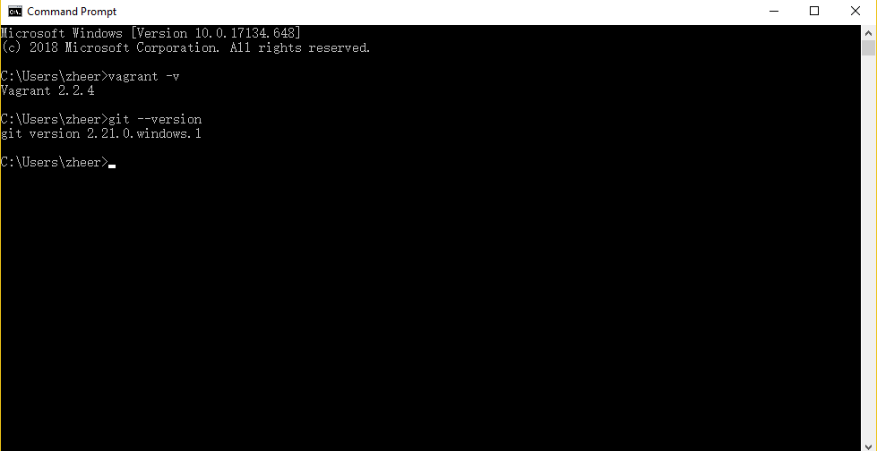


4. Then you can follow the Step 1 to Step 7 in the OS X guide for creating a github account, setting up ssh and cloning the destination repo. You can use Windows Command Prompt instead of MacOS Terminal. Something you need to pay attention here:


	In step 4, you can simply copy your key by opening it directly. It's located in C:\Users\YOUR_USER_NAME\.ssh\id_rsa.pub. Please replace YOUR_USER_NAME within your user name. You can open it with Notepad, Sublime, etc.

	Tip: You can also use Git Bash. You can easily find it by clicking right button in File Explorer. Please use the following command to check the existence of an ssh key and copy its content in Git Bash. (Thank you Themis for this useful tip!)

```
ls -al ~/.ssh
clip < ~/.ssh/id_rsa.pub
```

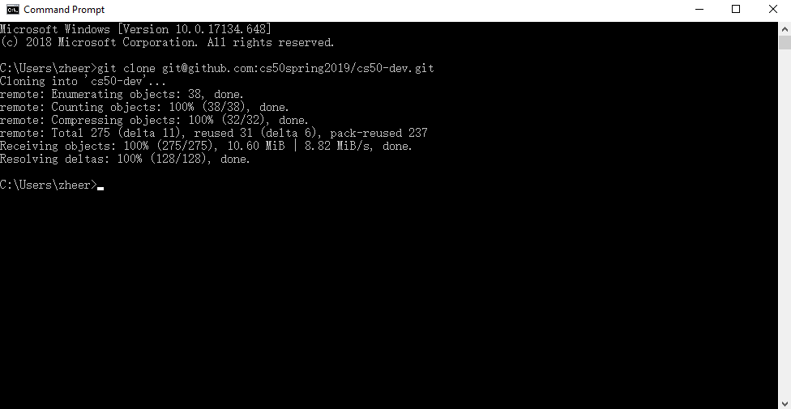

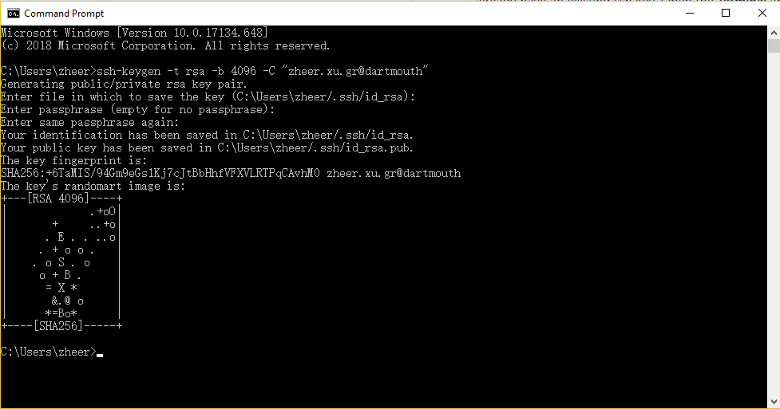

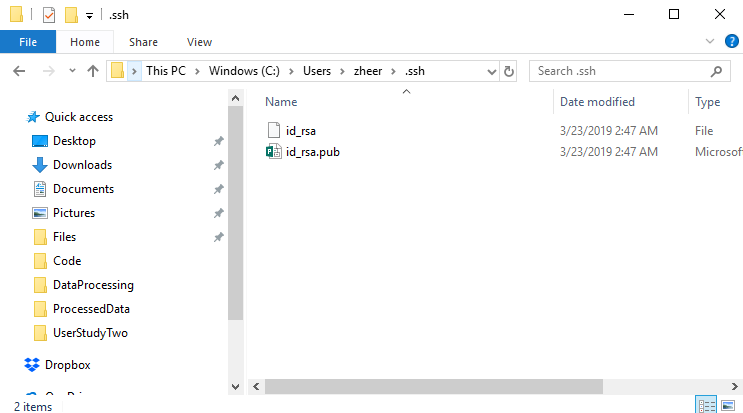

*Important Note*: If you want to use push, clone or pull something from Github in the virtual machine, it's better to have your ssh key inside it. Please modify Line 24 in Vagrantfile to this:


```
ssh_key_path = "C:/Users/YOUR_USER_NAME/.ssh/"
```

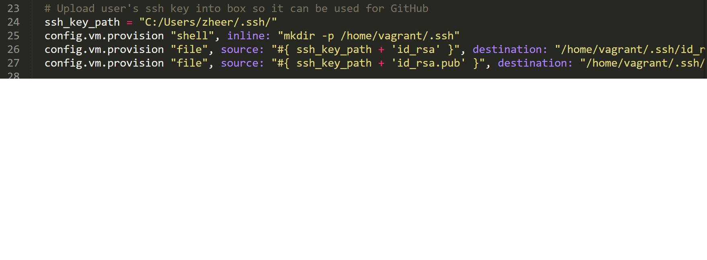

Please replace YOUR_USER_NAME with your username. Note that skipping this step is fine, since cs50-dev is the shared folder and you can do the Github stuff in your host machine.


5. After you clone the repo, please cd into the cs-50dev folder and run the following command to set up your virtual machine correctly within Vagrant. You can check the figure if you are not clear about it.

```
vagrant up
```

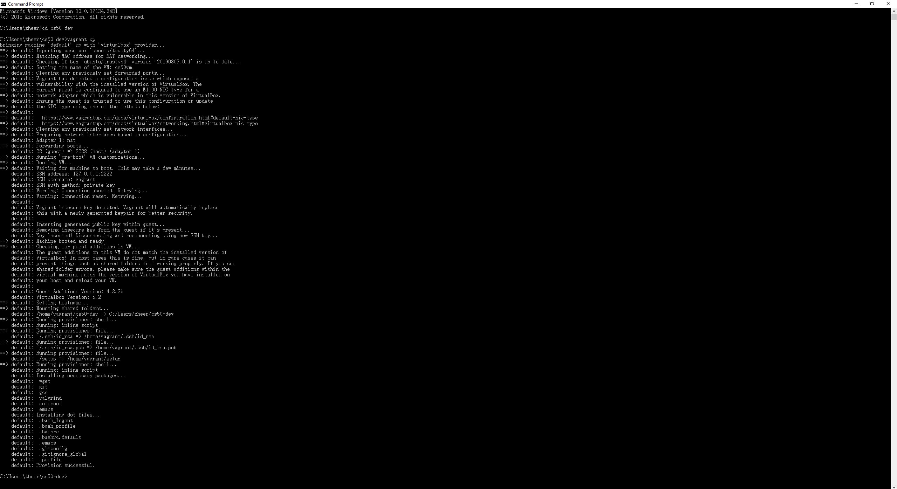

It really takes some time. Please be patient. After it's finished, you can use the following command to access the machine and play with it.

```
vagrant ssh
```

You can use the following command to shutdown the VM.

```
vagrant halt
```


6. Please use the following command for dotfiles configurations.

```
git config --global core.excludesfile ~/.gitignore_global
```

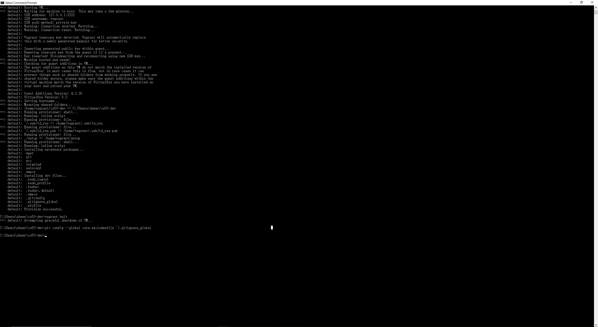